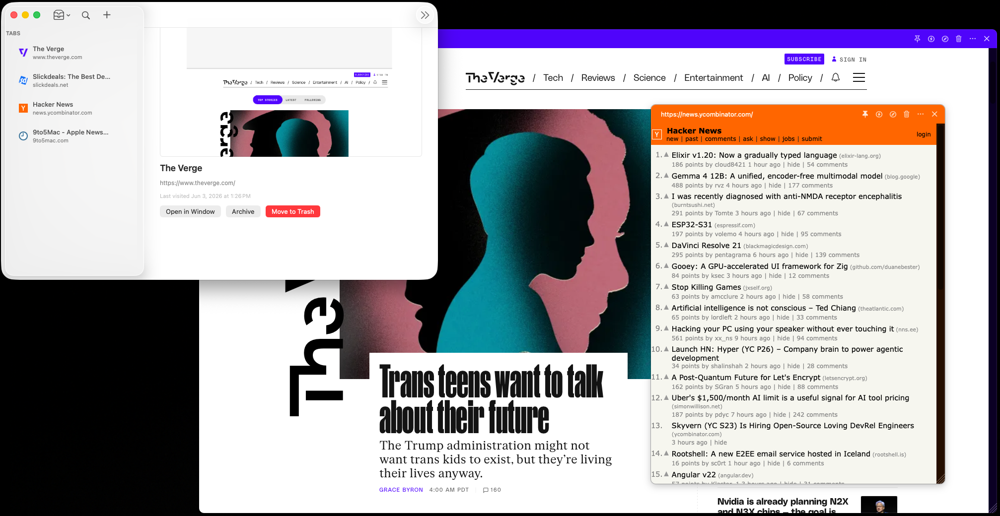

<div align="center">


# Webbed

**A cross-platform, iCloud-synced browser for macOS, iPadOS, and iOS.**
Built on `WKWebView`. Zero third-party dependencies.



</div>

---

## What it is

Webbed treats **a browsing session as a record** — every tab is a syncable
object (URL, title, scroll, pin, frame, theme, group) that lives in
iCloud Drive and can be opened on any of your devices.

On macOS each tab is its own **borderless, tear-out window** with custom
chrome that auto-tints to match the page. On iPadOS / iOS the same tab
library renders in a SwiftUI `NavigationSplitView` with Safari-style
glass chrome.

## Highlights

- **Per-tab tear-out windows (macOS)** — every tab is an independent
  borderless window with custom chrome, pin-on-top, and a resize handle.
- **Auto-tinted chrome** — the page's dominant color drives the window
  chrome and toolbar palette; the iOS top bar adopts the page theme via
  `toolbarBackground` while glass surfaces keep system foreground for
  legibility.
- **Library window (master/detail)** on macOS for browsing, archiving,
  and trashing tabs without opening them.
- **iCloud sync** — tab records and the pinned-sessions list sync across
  devices via the `iCloud.com.arjun.Webbed` ubiquity container, watched
  by `NSMetadataQuery`.
- **Live Mode** — per-window auto-refresh on a configurable interval,
  exposed from a popover in the chrome.
- **Open in Browser** — hand any tab off to Safari, Chrome, Firefox,
  Arc, or any other installed browser via a picker that enumerates
  registered HTTP handlers.
- **Per-origin permission controls** — camera, microphone, location,
  and notifications are gated per-origin with a privacy popover.
- **Favicon + snapshot cache** — favicons render in list rows; a disk
  cache backs thumbnails with stats and Clear / Regenerate controls in
  Settings.
- **App Intents & Shortcuts** — open a URL, start a new tab, or trigger
  Live Mode from Spotlight, Shortcuts, or Siri.
- **Search providers** — DuckDuckGo, Google, Kagi, and others
  selectable in Settings; the address field auto-detects URL vs query.
- **Responsive macOS layout** — the window collapses to a compact
  "mobile" layout below a width breakpoint.
- **iOS feature parity** — settings, snapshots, per-tab theme, sync
  status, and a bottom glass URL pill that reserves space so cookie
  banners remain reachable.

## Architecture

```
AppCoordinator (singleton)
├── TabStore                  active / archived / trash buckets
├── WindowManager             one TabWindowController per open tab (macOS)
├── PersistenceService        JSON + PNG sidecar per UUID → iCloud Drive
├── ThemeRegistry             chrome accent palettes
├── FaviconCache              in-memory + on-disk LRU
└── iCloudChangeObserver      NSMetadataQuery
```

- **macOS**: AppKit shell (`main.swift` → `NSApplication.shared.run()`)
  with SwiftUI for utility panes (Settings, popovers).
- **iOS / iPadOS**: SwiftUI App lifecycle with `NavigationSplitView`
  (regular) / `NavigationStack` (compact).
- **Shared**: `WebbedKit` Swift package — models, persistence, settings,
  sync observer, favicon cache, search providers, permission store.

See [plan.md](plan.md) for the full engineering spec.

## Build

```sh
brew install xcodegen          # one-time
xcodegen generate              # regenerates Webbed.xcodeproj from project.yml
open Webbed.xcodeproj
```

Or from the command line:

```sh
xcodebuild -scheme Webbed     -configuration Debug -destination 'platform=macOS'                       build
xcodebuild -scheme WebbediOS  -configuration Debug -destination 'generic/platform=iOS Simulator'       build
```

The default checkout uses ad-hoc signing (`-` identity) so the project
builds without any developer account configuration. Copy
[Configs/Signing.local.xcconfig.example](Configs/Signing.local.xcconfig.example)
to `Signing.local.xcconfig` and set `DEVELOPMENT_TEAM` for a real
signing identity.

## iCloud Sync

iCloud-backed sync is **enabled** by default. Both targets ship with the
`com.apple.developer.icloud-container-identifiers`,
`com.apple.developer.icloud-services` (`CloudDocuments`), and
`com.apple.developer.ubiquity-container-identifiers` entitlements
pointing at `iCloud.com.arjun.Webbed`, and the matching
`NSUbiquitousContainers` block in each `Info.plist` so the container
surfaces as "Webbed" in iCloud Drive / the Files app.

Requirements for sync to actually flow:

1. A real `DEVELOPMENT_TEAM` in `Configs/Signing.local.xcconfig`.
2. The `iCloud.com.arjun.Webbed` container registered against that team
   (Xcode → Signing & Capabilities → iCloud, or
   developer.apple.com → Identifiers → iCloud Containers).
3. Both devices signed into the same iCloud account with iCloud Drive
   enabled.

When `StorageLocationResolver.iCloudAvailable` is true,
`AppSettings.syncWithICloud` defaults to `true` and
`effectiveSaveDirectory` resolves to the ubiquity container's
`Documents/` folder. The `iCloudChangeObserver` in `WebbedKit` picks up
external `<uuid>.json` updates via `NSMetadataQuery` and patches them
into the in-memory `TabStore`.

If you need to build a fresh clone with **no Apple Developer account**,
re-comment the `com.apple.developer.icloud-*` keys in both
`*.entitlements` files (and the `NSUbiquitousContainers` blocks in the
`Info.plist`s) and re-run `xcodegen generate` — the app will fall back
to the local sandbox container automatically.
